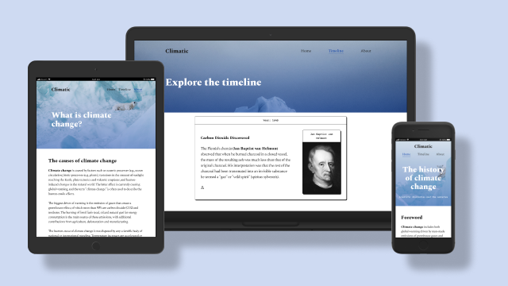

# Climatic

Climatic helps people learn about climate change by providing the most accurate online content so people can learn quickly and easily.

## Features 

### Existing features

- **Responsive**
  - Mobile-first design and development process, to ensure the site is fully responsive and accessible from any device.
- **Accessibility**
  - Design: high contrast colours, large font sizes and whitespace to aid readability.
  - Development: syntactically correct HTML, alt tags for images to help screen readers.
- **Navigation**
  - Identical across all pages, easy to find and use, the navigation includes links to "Home", "Timeline" and "About".
  - This allows users to easily navigate between pages on all devices without having to use the browser's "back" button.

- **Header images**
  - Photo with text overlay so users can see why they're on that page.
  - Stunning, high quality photography (hat tip to Annie Spratt ♥️) to catch the eye and grab attention.

- **Supporting images**
  - Related images that support the main content with brand colour overlays.

- **Learn more call to action**
  - Background image that draws attention.
  - Snippet with more information about what climate change is.
  - Button to the "About" page to read more.

- **Links section**
  - Lists for further reading and climate charities, to encourage readers to learn more or take action.
  - The list for further reading contains external links to authorities on climate change, such as NASA.
  - The list of climate charities contains external links to well known charities working to slow climate change.

- **Footer section**
  - Identical across all pages.
  - Credits: Lists sources for content, images and icons, with external links for each.
  - "I declare a climate emergency logo" to show support for the climate-emergency.com page and encourage action.
  - Footnote to indicate who created the site - i.e. me :)

- **Timeline page**
  - Individual cards for each scientific advance in the history of climate science.
  - Supporting images for each card, in greyscale to compensate for the differences in image styles (some are illustrations, others are photographs, for example).
  - External links to additional reading on the cards where relevant.

- **About page**
  - More detailed information on what climate change is and what the main contributors are, i.e. humans.
  - Supporting pictures (diagrams) showing the rise in temperature over the years.
  - A recent quote from BBC news confirming that "...humans are warming the planet".
  - Then followed by the same collection of links as on the homepage, in the hope that readers will feel moved to learn more or do something to help.

### Features left to implement

- **Timeline navigation**
  - A way to jump around the years in the timeline quickly and remove the need to scroll.

## Testing 

### Validator testing 

- HTML
  - No errors were found when running the official [W3C validator](https://validator.w3.org/nu/?doc=https%3A%2F%2Flucywoodman.github.io%2Fclimatic%2F)
- CSS
  - No errors were found when running the official [(Jigsaw) CSS validator](https://jigsaw.w3.org/css-validator/validator?uri=lucywoodman.github.io%2Fclimatic%2F&profile=css3svg&usermedium=all&warning=1&vextwarning=&lang=en)
- Accessibility
  - Score of 100 for accessibility via Google's Lighthouse.

## Deployment

- The site is deployed on GitHub pages. The steps to deploy are as follows:
  - In the GitHub repository, navigate to the Settings tab and then to the Pages submenu tab.
  - Select Branch: main from the Source drop-down menu.
  - Once the source is selected, a banner will appear indicating that the site has been published and display the link.
- This repositories link is: https://lucywoodman.github.io/climatic/

## Credits

### Content

- The main content of this site comes from [Wikipedia - Climate change](https://en.wikipedia.org/wiki/Climate_change) and [Wikipedia - History of climate change science](https://en.wikipedia.org/wiki/History_of_climate_change_science).
- Timeline information is from [UCAR](https://scied.ucar.edu/learning-zone/how-climate-works/history-climate-science-research), with modifications to ensure the information is accurate and focuses only on scientific advances.
- The icons used throughout the site are from [Phosphoricons](https://phosphoricons.com).

### Media

- Photos used as header or background images are from [Unsplash - Annie Spratt](https://unsplash.com/@anniespratt).
- Additional photos/images used as supporting images are from [Unsplash](https://unsplash.com/collections/Y9a6e354pAw/climatic) or [Wikimedia Commons](https://commons.wikimedia.org/wiki/Main_Page).